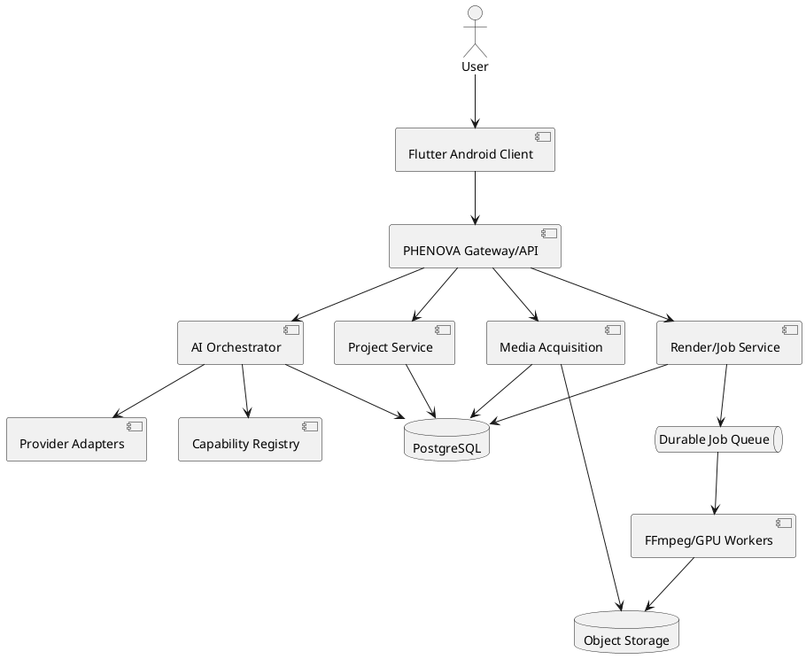
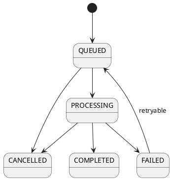

# SPEC-001-PHENOVA-FULL-PRODUCTION-EDITOR

## Background

PHENOVA is an AI-first professional video editor requiring a complete production-grade launch with four mandatory systems: Manual Editor, AI Editor, AI Generation, and Media Acquisition. The editor must operate on one canonical, non-destructive, versioned project model. IFEC is optional and must never be a hard dependency.

## Requirements

### Must have
- Professional multi-track non-destructive timeline.
- Real FFmpeg/equivalent rendering and export.
- Canonical project state shared by manual editing, AI editing, generation, acquisition, preview, and rendering.
- AI-generated versioned Edit Plans with source/generation constraints.
- Explicit separation between editing and generation.
- Provenance and rights metadata for acquired and generated media.
- Durable authentication, ownership, projects, jobs, versions, quotas, and entitlements.
- Server-enforced Free/Premium rules and UTC quota reset.
- Real progress, cancellation, retry, cleanup, and durable job state.
- Capability registry that hides unsupported operations.
- Honest failure for unsupported resources and missing providers.
- Automated and real-media tests.

### Should have
- Local/offline editing and cached previews where technically possible.
- Provider adapters for multiple AI and media sources.
- Motion tracking, matting, captioning, audio enhancement, and creative intelligence.
- Operational metrics, tracing, and recovery automation.

### Could have
- Collaboration-ready event model.
- Advanced GPU acceleration and multi-device synchronization.

## Method

### Logical architecture

### Canonical domain entities

- `users`: id, email, password_hash, status, created_at, updated_at.
- `sessions`: id, user_id, token_hash, expires_at, revoked_at, created_at.
- `plans`: id, code, version, price_minor, currency, active.
- `subscriptions`: id, user_id, plan_id, provider_reference, status, period_start, period_end.
- `projects`: id, owner_id, name, schema_version, source_policy, current_version_id, created_at, updated_at, deleted_at.
- `project_versions`: id, project_id, parent_version_id, version_number, snapshot_uri/hash, created_by, created_at.
- `media_assets`: id, owner_id, project_id, origin, provider, source_uri, storage_uri, license_metadata, checksum, duration_ms, width, height, fps, codec, audio_present, validation_status.
- `tracks`: id, project_version_id, track_type, ordinal, muted, locked.
- `clips`: id, track_id, media_asset_id, source_in_ms, source_out_ms, timeline_start_ms, timeline_duration_ms, transform_json, effects_json.
- `operations`: id, project_id, version_id, actor_type, operation_type, payload_json, inverse_payload_json, created_at.
- `ai_edit_plans`: id, project_id, conversation_id, plan_version, source_policy, steps_json, validation_status, accepted_at.
- `render_jobs`: id, owner_id, project_id, version_id, job_type, state, progress, idempotency_key, attempts, error_code, created_at, started_at, completed_at.
- `quota_ledger`: id, user_id, period_start_utc, event_type, job_id, units, idempotency_key, created_at.
- `capabilities`: id, operation_code, state, constraints_json, platform, test_reference, updated_at.

### Source policy

Allowed values:
- `USER_ONLY`
- `USER_AND_LICENSED_ONLINE`
- `USER_AND_GENERATED`
- `USER_LICENSED_AND_GENERATED`

The execution layer must reject any Edit Plan step that violates the project policy. A no-generation instruction must be persisted as an enforceable constraint and checked before tool execution.

### AI execution flow

1. Inspect actual project/media intelligence.
2. Resolve user intent and source policy.
3. Produce schema-validated Edit Plan.
4. Validate referenced assets, capabilities, permissions, and quotas.
5. Compute a minimal diff against the current canonical version.
6. Require acceptance when the product flow requires confirmation.
7. Apply operations transactionally.
8. Persist operation graph, inverse operations, AI log, and new project version.
9. Enqueue render/preview work if requested.
10. Expose progress and allow undo/rejection/restoration.

### Job state machine

Rules:
- Idempotency key prevents duplicate quota consumption.
- Infrastructure retry does not create a new user edit charge.
- User-requested new edit creates a new chargeable event when policy allows.
- Jobs required by active versions must not be pruned.
- Temporary files are cleaned on success, failure, and cancellation.

### Security baseline

- Password hashing with a modern adaptive password hash.
- Short-lived access tokens and revocable sessions.
- Server-side authorization on every project, asset, version, and job.
- HTTPS in production.
- Secrets only in server-side configuration.
- Upload validation using content inspection, size limits, safe generated storage keys, and path traversal prevention.
- Rate limits on authentication, AI, upload, acquisition, and render endpoints.
- Restricted CORS.
- Structured errors without internal hostnames or secrets.
- Audit events for authentication, entitlement changes, AI plan acceptance, media import, and rendering.

## Implementation

1. Establish clean build environments and lockfiles.
2. Add PostgreSQL configuration and Alembic migrations.
3. Normalize domain models and ownership constraints.
4. Implement durable session and entitlement services.
5. Implement transactional quota ledger and idempotency.
6. Harden gateway transport, CORS, limits, and errors.
7. Complete object storage and resumable upload adapters.
8. Implement durable render workers and recovery.
9. Validate Edit Plan schema, source policy, minimal diffs, and operation inverses.
10. Add real-media fixtures for video, audio, captions, transitions, masks, and exports.
11. Integrate licensed media providers with provenance records.
12. Integrate generation providers behind explicit authorization.
13. Run Flutter device tests and signed release builds.
14. Run staging load, failure, recovery, and security tests.

## Milestones

- M1: Clean reproducible build and dependency verification.
- M2: Durable database, migrations, authentication, and ownership.
- M3: Canonical project/version/operation integrity.
- M4: Rendering and job reliability.
- M5: AI Edit Plan and no-generation enforcement.
- M6: Media acquisition and provenance.
- M7: Quotas, payments, and entitlement verification.
- M8: Android device acceptance and release pipeline.
- M9: Production observability, recovery, and launch sign-off.

## Gathering Results

Acceptance requires recorded evidence for:
- Build, lint, unit, integration, security, and real-media tests.
- Actual output media validation.
- Targeted AI correction preserving unrelated operations.
- Source-policy enforcement.
- Quota behavior under concurrency and retries.
- Authorization isolation between users.
- Cancellation and worker recovery.
- Release APK/AAB installation and smoke testing on real Android devices.
- Defined service-level objectives and post-launch error monitoring.

## Definition of Done

A feature is launchable only when UI, backend/core behavior, persistence, error handling, and verification are complete. Unsupported capabilities must be unavailable rather than simulated. IFEC may enhance the system but cannot be required for core editing.
